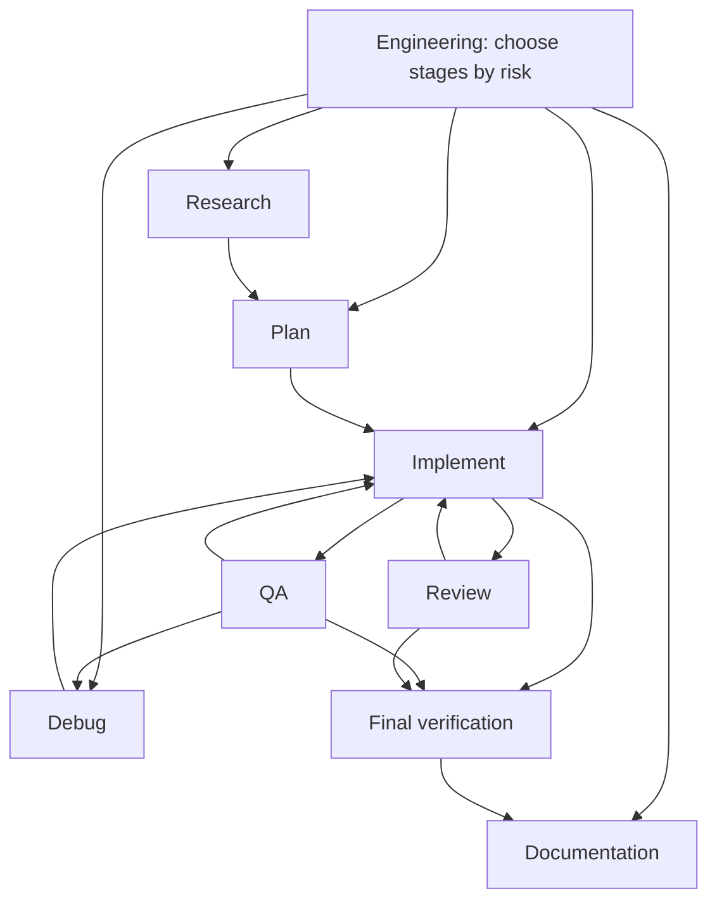

# Engineering agents for GitHub Copilot

Reusable custom agents for .NET, ASP.NET Core, AWS, serverless, and distributed backend engineering. They guide investigation, implementation, testing, review, debugging, and documentation. They are prompts and tool configurations, not a substitute for repository knowledge or human ownership.

This collection currently lives inside an Obsidian software-engineering knowledge base. Its existing `kb-*` agents and the knowledge-base sections of `.github/copilot-instructions.md` serve that vault. When installing in an application, copy the eight engineering agent files and selected instruction files; merge or replace the repository-wide instructions with your application's own concise rules. Do not copy knowledge-base-specific instructions or agents by accident.

## Architecture

Edges show possible transitions, not a mandatory sequence. Engineering chooses only stages that improve confidence for the task. VS Code handoff buttons prefill a transition and leave submission to the engineer; specialist agents can also be invoked as subagents when the host supports it.

## Agents

| Agent | Purpose | Read/write behavior | Typical use |
| --- | --- | --- | --- |
| Engineering | Coordinate and synthesize work | Reads, edits, executes | Start a feature or mixed task |
| Research | Establish code and external facts | Read-only tools | Unfamiliar area or framework behavior |
| Planner | Make an executable design | Read-only tools | Significant change or migration |
| Implementer | Change code and verify | Reads, edits, executes | Focused production change |
| Reviewer | Independent risk review | Read-only tools | Review a diff or PR |
| QA | Challenge behavior and tests | Reads and executes; no edit tool | Risk-based verification |
| Debugger | Establish root cause, fix when evidenced | Reads, executes, edits | Intermittent or unexplained failure |
| Documentation | Update written guidance | Reads and edits; prompt limits edits to docs | Setup, API, runbook change |

Engineering is the primary picker entry. Research, Planner, Reviewer, and Debugger remain directly selectable. Implementer, QA, and Documentation are hidden from the picker with `user-invocable: false` but remain available to orchestration. Tool restrictions are a capability boundary; Documentation's *file type* boundary is an instruction because portable Copilot agent frontmatter does not enforce write paths. QA can run commands; a command may itself have side effects, so run only safe checks.

## Installation

1. Add these eight `.agent.md` files to the consuming repository's `.github/agents/` directory. VS Code supports `.agent.md` there; GitHub Copilot cloud recognizes repository profiles in `.github/agents/` as `.md` or `.agent.md`.
2. Copy relevant `.github/instructions/*.instructions.md` files. Review each `applyTo` glob against actual paths. AWS guidance uses narrow automatic matches plus task relevance; attach it manually or adjust its glob for a repository with different IaC names.
3. Merge the generic engineering section of `.github/copilot-instructions.md` into the consuming repository's existing `.github/copilot-instructions.md`. Omit this vault's `# Knowledge Base Guidelines` section in an application. Keep that shared file concise and put language or domain rules in path-specific files.
4. In VS Code, open the workspace, choose the Copilot session target and select Engineering in the agent picker. Use the customizations diagnostics view if an agent or instruction file does not appear. Available tools and subagent support depend on host and configuration.

For organization-wide distribution, GitHub supports `/agents/NAME.md` in an organization's `.github` or `.github-private` repository. VS Code organization agent discovery may require `github.copilot.chat.organizationCustomAgents.enabled`. Check your organization policy before distributing. These are official supported locations, not a publication step performed by this repository.

## Shared instructions

- `.github/copilot-instructions.md`: always-on repository guidance. Here it contains vault-specific guidance plus a generic engineering section; adapt when copying.
- `.github/instructions/*.instructions.md`: task and path guidance selected by `description` and `applyTo`. Patterns are workspace-relative, comma-separated globs.
- `.github/agents/*.agent.md`: role, allowed tools, subagent list where applicable, and VS Code handoff suggestions.
- `AGENTS.md`: cross-agent repository instructions. This repository has one for its knowledge base. A consuming repository's own `AGENTS.md` may add requirements; avoid contradictory copies.

## Usage examples

- Engineering: “Add an endpoint for retrieving an order. Preserve existing API and test conventions.”
- Debugger: “Investigate why this Lambda intermittently processes SQS messages twice. Establish cause before changing code.”
- Reviewer: “Review this PR for production readiness; report only substantive findings.”
- Planner: “Plan migrating this synchronous workflow to Step Functions. Include rollout and rollback.”
- QA: “Check whether our integration-test strategy gives useful confidence for this service boundary.” Ask Engineering to invoke QA where the host hides it from the picker.

## Recommended workflows

| Task | Suggested stages |
| --- | --- |
| Small change | Implement, focused verification |
| Bug | Debug, fix, regression test, review when risk warrants |
| Feature | Research if needed, plan, implement, QA, review |
| Large architecture change | Research, plan and challenge design, implement, QA, review, documentation |
| Code review | Reviewer; no implementation unless requested |
| Production incident | Debug from logs and runtime evidence, mitigate with authority, regression protection, review, runbook update |

## Philosophy

Research before assumptions. Plan before significant changes. Implement minimally. Test behavior. Review independently when risk warrants. Debug scientifically. Document reality. Existing repository architecture and conventions outrank generic patterns. Correctness, security, reliability, maintainability, simplicity, testability, and observability drive decisions; performance and cost matter where evidence shows they matter.

## Customization

Adapt architecture rules to real boundaries and team decisions. Set the supported .NET version, C# language version, test framework and fixtures, AWS deployment stack, and security controls from the consuming repository. The files do not assume xUnit, NUnit, MSTest, Terraform, CDK, CloudFormation, EF, DynamoDB, MediatR, CQRS, or Clean Architecture. Edit instruction globs if local naming differs. Review tools in the actual host before tightening or expanding them.

## Schema and host behavior

As checked **2026-09-24**, official GitHub and VS Code docs support `.agent.md` with YAML `name`, `description`, `tools`, `user-invocable`, `disable-model-invocation`, and `target`. VS Code also supports `agents` and `handoffs`; GitHub cloud currently ignores `handoffs`. We leave `target` unset for both environments, omit model pins so the selected model applies, and omit deprecated `infer`. `tools` use GitHub's published aliases `read`, `search`, `edit`, `execute`, `web`, and `agent`; `web` is host-dependent and currently not applicable to GitHub cloud. `agents` is used only on Engineering alongside `agent` tool. Every handoff uses `send: false`; it suggests a transition without submitting work automatically. GitHub cloud behavior may differ from VS Code, especially subagent orchestration and handoffs.

Official references: [GitHub agent configuration](https://docs.github.com/en/copilot/reference/custom-agents-configuration), [GitHub custom agent locations](https://docs.github.com/en/copilot/concepts/agents/cloud-agent/about-custom-agents), [VS Code custom agents](https://code.visualstudio.com/docs/agent-customization/custom-agents), [VS Code custom instructions](https://code.visualstudio.com/docs/agent-customization/custom-instructions), [GitHub CLI custom instructions](https://docs.github.com/en/copilot/how-tos/copilot-cli/customize-copilot/add-custom-instructions). Accessed 2026-09-24.

## Limitations

AI-generated code still needs engineering judgment. Host tools and permissions vary. No agent can claim runtime verification, deployment, security review, or production behavior it did not observe. These agents do not replace production monitoring, formal security review, or human accountability. The collection has not been exercised in every Copilot host; use that host's customization diagnostics and a small trial task after installation.
